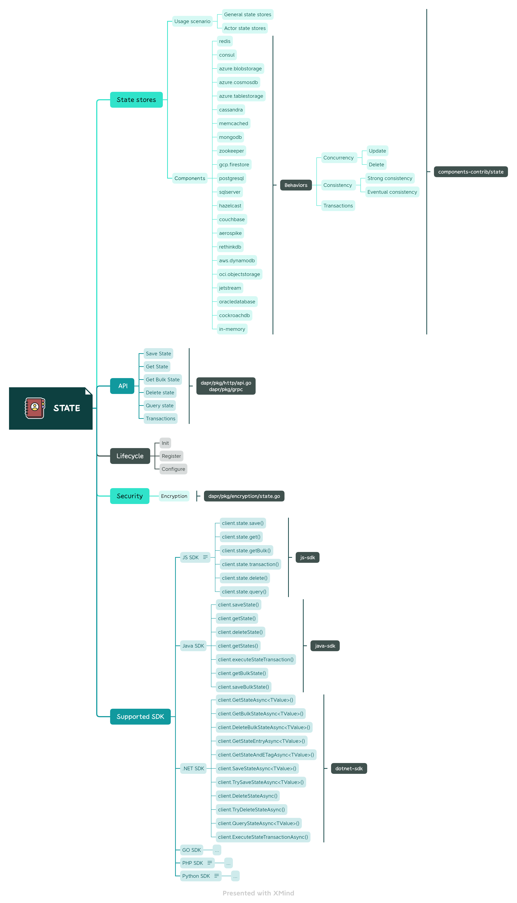
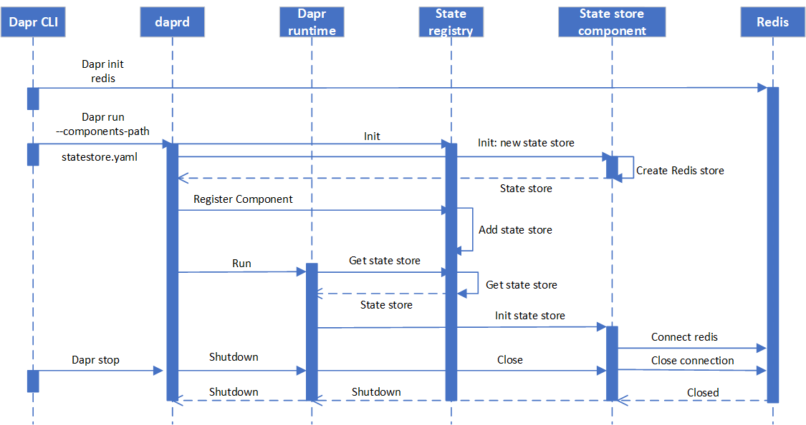
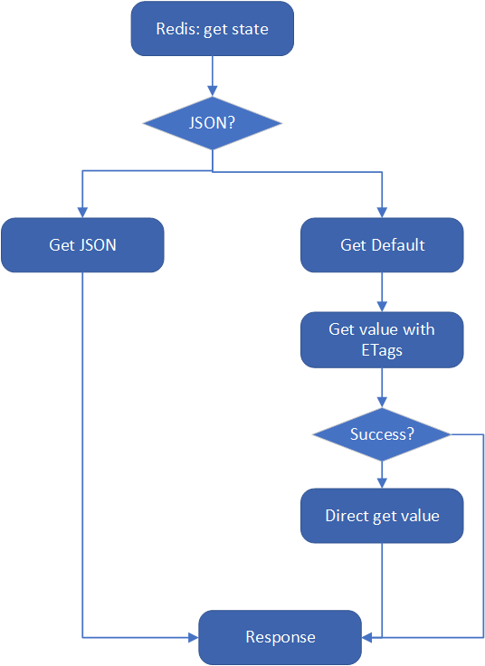

## 概述

下图为状态管理构建块的概览：



接下来将会从生命周期管理、与状态存储的交互和关键代码阅读来展开。

术语：

- 状态存储：Dapr中管理后台具体数据库的对象。属于Dapr运行时的一部分。如Redis状态存储。
- 状态管理组件：后台管理状态的具体数据库。如Redis。

## 生命周期管理

这个部分将介绍状态存储的注册的流程。

### 时序图

下图展示了本地托管模式下，创建Redis状态存储的时序图。



### 创建和初始化状态存储

状态存储达到能被API调用之前需要经历几个步骤：创建状态存储 -> 注册状态存储 -> 初始化状态存储 -> 连接后台数据库，即存储组件。

1. 程序入口： `dapr\cmd\daprd\main.go`。

2. 创建状态存储。

    创建状态存储的目录：`dapr\cmd\daprd\components`，`init()`方法中创建了相应类型的状态存储。 
    如Redis状态存储实现在`dapr\cmd\daprd\components\state_redis.go`。

    ```go
    func init() {
        // 创建状态存储，不同类型的组件实现源码在components-contrib\state。
        // 注册状态存储，见#3.
        stateLoader.DefaultRegistry.RegisterComponent(redis.NewRedisStateStore, "redis")
    }
    ```

    不同类型状态存储的实现见：`components-contrib\state`。
    所有的状态存储都通过`New<CompName>StateStore`来创建对象，返回`statestore`对象。
    如创建Redis状态存储的代码：

    ```go
    // NewRedisStateStore returns a new redis state store.
    func NewRedisStateStore(logger logger.Logger) state.Store {
        s := &StateStore{
            json:     jsoniter.ConfigFastest,
            features: []state.Feature{state.FeatureETag, state.FeatureTransactional, state.FeatureQueryAPI},
            logger:   logger,
        }

        // 创建批量操作存储
        s.DefaultBulkStore = state.NewDefaultBulkStore(s)

        return s
    }
    ```

    每一种类型的状态存储都有相应的StateStore定义，如下是Redis的state store的结构。

    ```go
    type StateStore struct {
        state.DefaultBulkStore
        client         redis.UniversalClient
        clientSettings *rediscomponent.Settings
        json           jsoniter.API
        metadata       rediscomponent.Metadata
        replicas       int
        querySchemas   querySchemas

        features []state.Feature
        logger   logger.Logger

        ctx    context.Context
        cancel context.CancelFunc
    }
    ```

    我们可以发现，Redis的StateStore其中一个属性是`state.DefaultBulkStore`。方法`New<CompName>StateStore`创建状态存储时，会给支持批量操作的组件创建一个默认的`BulkStore`，目前支持批量操作的状态存储有：

        - Aerospike
        - Azure Blob Storage
        - Azure Cosmos DB
        - Azure Table Storage
        - Cassandra
        - Couchbase
        - GCP Fire
        - Hashicorp Consul
        - Hazelcast
        - Jetstream
        - MemCache
        - MongoDB
        - OCIObjectStorage
        - Redis

    对于组件的最新状态，参见https://docs.dapr.io/zh-hans/reference/components-reference/supported-state-stores/。

3. 注册状态存储。

    状态管理构建块管理组件的源代码在`dapr\pkg\components\state\registry.go`。
    注册状态存储组件的代码如下，`stateStores`是`map`类型，键为组件的全名，值为`New<CompName>StateStore`返回的`statestore`对象。

    ```go
    // RegisterComponent adds a new state store to the registry.
    func (s *Registry) RegisterComponent(componentFactory func(logger.Logger) state.Store, names ...string) {
        for _, name := range names {
            s.stateStores[createFullName(name)] = componentFactory
        }
    }
    ```

4. 初始化状态存储。

    运行时解析组件配置并初始化状态存储。源代码见：`dapr\pkg\runtime\runtime.go`。

    ```go
    // Refer for state store api decision  https://github.com/dapr/dapr/blob/master/docs/decision_records/api/API-008-multi-state-store-api-design.md
    func (a *DaprRuntime) initState(s componentsV1alpha1.Component) error {
        // 获取状态存储
        store, err := a.stateStoreRegistry.Create(s.Spec.Type, s.Spec.Version)
        ... ...

        if store != nil {
            // 处理自动加密的逻辑
            secretStoreName := a.authSecretStoreOrDefault(s)

            secretStore := a.getSecretStore(secretStoreName)
            encKeys, encErr := encryption.ComponentEncryptionKey(s, secretStore)
            ... ...
            if encKeys.Primary.Key != "" {
                ok := encryption.AddEncryptedStateStore(s.ObjectMeta.Name, encKeys)
                if ok {
                    log.Infof("automatic encryption enabled for state store %s", s.ObjectMeta.Name)
                }
            }

            // 解析组件配置 statestore.yaml
            props := a.convertMetadataItemsToProperties(s.Spec.Metadata)
            // 初始化状态存储，不同类型组件的状态存储初始化源代码在components-contrib\state, 见#4。
            err = store.Init(state.Metadata{Base: contribMetadata.Base{
                Properties: props,
            }})
            
            ... ...

            a.stateStores[s.ObjectMeta.Name] = store
            err = stateLoader.SaveStateConfiguration(s.ObjectMeta.Name, props)
            if err != nil {
                diag.DefaultMonitoring.ComponentInitFailed(s.Spec.Type, "init", s.ObjectMeta.Name)
                wrapError := fmt.Errorf("failed to save lock keyprefix: %s", err.Error())
                fName := fmt.Sprintf(componentFormat, s.ObjectMeta.Name, s.Spec.Type, s.Spec.Version)
                return NewInitError(InitComponentFailure, fName, wrapError)
            }

            // 处理Actor state store的逻辑
            // when placement address list is not empty, set specified actor store.
            if len(a.runtimeConfig.PlacementAddresses) != 0 {
                // set specified actor store if "actorStateStore" is true in the spec.
                actorStoreSpecified := props[actorStateStore]
                if actorStoreSpecified == "true" {
                    a.actorStateStoreLock.Lock()
                    if a.actorStateStoreName == "" {
                        log.Infof("detected actor state store: %s", s.ObjectMeta.Name)
                        a.actorStateStoreName = s.ObjectMeta.Name
                    } else if a.actorStateStoreName != s.ObjectMeta.Name {
                        log.Fatalf("detected duplicate actor state store: %s", s.ObjectMeta.Name)
                    }
                    a.actorStateStoreLock.Unlock()
                }
            }
            diag.DefaultMonitoring.ComponentInitialized(s.Spec.Type)
        }

        return nil
    }
    ```

    状态存储初始化并连接组件，源代码见`components-contrib\state\redis\redis.go`。

    ```go
    / Init does metadata and connection parsing.
    func (r *StateStore) Init(metadata state.Metadata) error {
        m, err := rediscomponent.ParseRedisMetadata(metadata.Properties)
        if err != nil {
            return err
        }
        r.metadata = m

        defaultSettings := rediscomponent.Settings{RedisMaxRetries: m.MaxRetries, RedisMaxRetryInterval: rediscomponent.Duration(m.MaxRetryBackoff)}
        r.client, r.clientSettings, err = rediscomponent.ParseClientFromProperties(metadata.Properties, &defaultSettings)
        if err != nil {
            return err
        }

        // check for query schemas
        if r.querySchemas, err = parseQuerySchemas(m.QueryIndexes); err != nil {
            return fmt.Errorf("redis store: error parsing query index schema: %v", err)
        }

        r.ctx, r.cancel = context.WithCancel(context.Background())

        // 根据组件配置文件提供的信息，连接Redis
        if _, err = r.client.Ping(r.ctx).Result(); err != nil {
            return fmt.Errorf("redis store: error connecting to redis at %s: %v", r.clientSettings.Host, err)
        }

        if r.replicas, err = r.getConnectedSlaves(); err != nil {
            return err
        }

        if err = r.registerSchemas(); err != nil {
            return fmt.Errorf("redis store: error registering query schemas: %v", err)
        }

        return nil
    }
    ```

## 交互

这部分将介绍与状态存储的所有交互，包括通过gRPC、HTTP和SDK来访问状态存储，以及操作状态存储的API。

### gRPC

消息的定义在`dapr\dapr\proto\runtime\v1\dapr.proto`。此处不展开介绍。如：

```go
// GetStateRequest is the message to get key-value states from specific state store.
message GetStateRequest {
  // The name of state store.
  string store_name = 1;

  // The key of the desired state
  string key = 2;

  // The read consistency of the state store.
  common.v1.StateOptions.StateConsistency consistency = 3;

  // The metadata which will be sent to state store components.
  map<string, string> metadata = 4;
}

### HTTP

HTTP API 的实现见 `dapr\pkg\http`。

```go
func (a *api) constructStateEndpoints() []Endpoint {
	return []Endpoint{
		{
			Methods: []string{fasthttp.MethodGet},
			Route:   "state/{storeName}/{key}",
			Version: apiVersionV1,
			Handler: a.onGetState,
		},
		{
			Methods: []string{fasthttp.MethodPost, fasthttp.MethodPut},
			Route:   "state/{storeName}",
			Version: apiVersionV1,
			Handler: a.onPostState,
		},
		{
			Methods: []string{fasthttp.MethodDelete},
			Route:   "state/{storeName}/{key}",
			Version: apiVersionV1,
			Handler: a.onDeleteState,
		},
		{
			Methods: []string{fasthttp.MethodPost, fasthttp.MethodPut},
			Route:   "state/{storeName}/bulk",
			Version: apiVersionV1,
			Handler: a.onBulkGetState,
		},
		{
			Methods: []string{fasthttp.MethodPost, fasthttp.MethodPut},
			Route:   "state/{storeName}/transaction",
			Version: apiVersionV1,
			Handler: a.onPostStateTransaction,
		},
		{
			Methods: []string{fasthttp.MethodPost, fasthttp.MethodPut},
			Route:   "state/{storeName}/query",
			Version: apiVersionV1alpha1,
			Handler: a.onQueryState,
		},
	}
}
```

### SDK


### CRUD

#### Get State

```go
// dapr/pkg/http/api.go
func (a *api) onGetState(reqCtx *fasthttp.RequestCtx) {
	store, storeName, err := a.getStateStoreWithRequestValidation(reqCtx)
	// ... ...

	metadata := getMetadataFromRequest(reqCtx)

    // ... ...
    // process consistency
	// state: "github.com/dapr/components-contrib/state"
	req := state.GetRequest{
		Key: k,
		Options: state.GetStateOption{
			Consistency: consistency,
		},
		Metadata: metadata,
	}

	// get response

    // process encrypted response data

	respond(reqCtx, withJSON(fasthttp.StatusOK, resp.Data), withEtag(resp.ETag), withMetadata(resp.Metadata))
}
```

Redis的实现在`components-contrib\state\redis\redis.go`，流程图如下：



#### Save state

## 关键代码阅读

### 事务

### 并发

### 一致性

### 安全

自动加密。

### 批量操作

### 状态的TTL

### 重试策略

## 小节